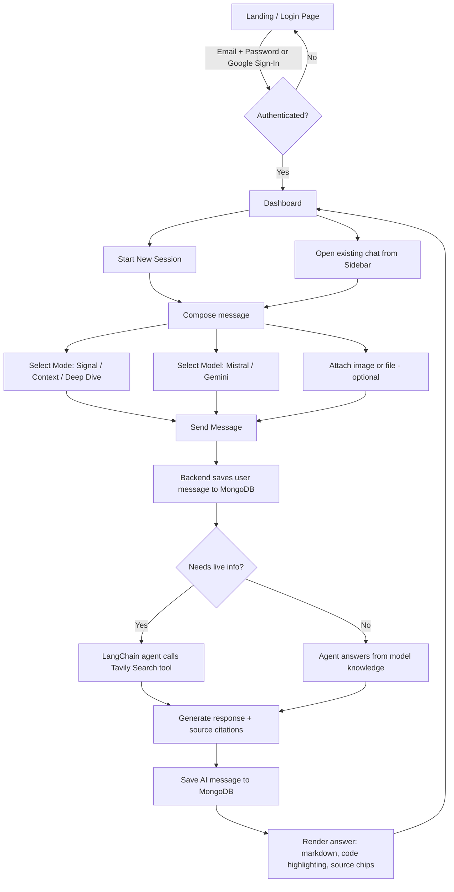
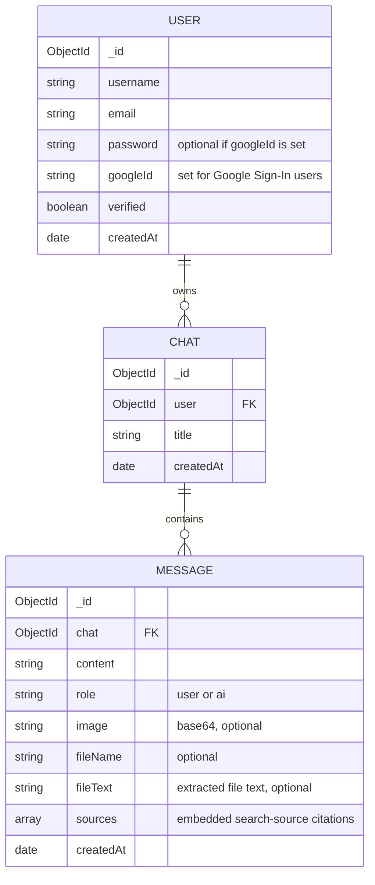

<div align="center">

# ⚡ Elix.ai

### High Signal. Zero Noise.

An AI chat assistant built to give **short, accurate, structured answers** — not endless paragraphs. Ask a question, get the facts, move on.

[](https://react.dev)
[](https://expressjs.com)
[](https://www.mongodb.com)
[](https://www.langchain.com)
[](https://tailwindcss.com)
[](#license)

[🔗 Live Demo](https://elix-ai-2i3g.vercel.app) · [Report a Bug](https://github.com/Lalitprajapat47/Elix-Ai/issues) · [Request a Feature](https://github.com/Lalitprajapat47/Elix-Ai/issues)

</div>

---

## 📖 About

Most AI chatbots default to long, hedging, paragraph-heavy answers. **Elix** is built around the opposite idea: give the user exactly what they asked for — short, structured, and verifiable — with the option to go deeper only when they actually want to.

Ask *"how do I get from Ajmer to Jaipur"* and Elix won't write you three paragraphs of travel history — it gives you the route, the time, and the options.

Built as a full MERN application with a LangChain-powered agent, real-time web search grounding, multi-model support, and a fully custom UI — not a wrapper around a chat template.

---

## ✨ Features

### Core chat experience
- 🎯 **Three response modes** — `Signal` (short & precise), `Context` (balanced), `Deep Dive` (thorough) — user-selectable per message
- 🤖 **Multi-model support** — switch between **Mistral Medium** and **Gemini**, with automatic fallback across multiple Gemini model variants if one is slow or unavailable
- 🌐 **Live web search grounding** — the agent decides when to search the internet (via Tavily) for up-to-date answers
- 🔗 **Source citations** — answers grounded in search show clickable source chips, Perplexity-style
- 🖼️ **Image understanding** — attach a photo/screenshot and ask questions about it (vision-capable models)
- 📎 **File understanding** — attach PDF, DOCX, or TXT files; text is extracted server-side and used as context
- 📋 **Paste-to-attach** — paste an image or file directly from the clipboard into the chat
- 🔁 **Regenerate response** — re-run the last answer if it isn't quite right
- ⏹️ **Stop generating** — cancel an in-flight response mid-stream
- 💬 **Syntax-highlighted code blocks** — with a one-click copy button per block
- 📝 **Rich markdown rendering** — headings, bold, tables, blockquotes, links

### Chat management
- 🗂️ Persistent chat history, grouped per user
- ✏️ Rename chats inline
- 🗑️ Delete chats
- 🔍 Search across chat history

### Auth & account
- 🔐 Email/password auth with **email verification**
- 🔑 **Google Sign-In** (OAuth 2.0 / Google Identity Services)
- 🍪 Secure, cross-domain, httpOnly cookie-based sessions (JWT)
- 👤 Persistent login across refreshes

### UI/UX
- 📱 Fully responsive — sidebar collapses to a mobile-friendly overlay
- 🎨 Custom dark UI — no template, hand-built components
- ⌨️ Animated typewriter placeholder, live "thinking" indicator
- ♻️ Auto-scroll, auto-focus, and optimistic UI updates for a fast feel

---

## 🛠️ Tech Stack

| Layer | Technology |
|---|---|
| **Frontend** | React 19, Vite, Redux Toolkit, React Router, Tailwind CSS 4 |
| **Backend** | Node.js, Express 5, MongoDB (Mongoose) |
| **AI / Agent** | LangChain (`createAgent`), Mistral (`mistral-medium-latest`), Google Gemini |
| **Search** | Tavily Search API |
| **Auth** | JWT (httpOnly cookies), bcryptjs, Google Identity Services (OAuth 2.0) |
| **File parsing** | `pdf-parse`, `mammoth` (DOCX) |
| **Realtime** | Socket.io |
| **Email** | Nodemailer |
| **Markdown / Code** | `react-markdown`, `remark-gfm`, `react-syntax-highlighter` |
| **Deployment** | Vercel (Frontend) · Render (Backend) |

---

## 🏗️ Architecture

```
Elix-Ai/
├── Backend/
│   ├── server.js                  # Local dev entry point
│   └── src/
│       ├── app.js                 # Express app, middleware, CORS
│       ├── config/database.js     # MongoDB connection
│       ├── controllers/           # auth.controller.js, chat.controller.js
│       ├── models/                # user, chat, message (Mongoose schemas)
│       ├── routes/                # auth.routes.js, chat.routes.js
│       ├── middleware/            # JWT auth middleware
│       ├── validators/            # request validation
│       ├── services/
│       │   ├── ai.service.js      # LangChain agent, system prompts, model fallback
│       │   ├── internet.service.js# Tavily search tool
│       │   ├── file.service.js    # PDF/DOCX/TXT text extraction
│       │   └── mail.service.js    # Nodemailer email service
│       └── sockets/                # Socket.io setup
│
└── Frontend/
    └── src/
        ├── app/                    # App shell, routes, Redux store
        └── features/
            ├── auth/                # Login, Register, Google Sign-In, auth state
            └── chat/                # Dashboard, chat state, message components
```

### How a message flows
1. User sends a message (with optional image/file, a selected **mode**, and a selected **model**) from the React frontend.
2. Express receives it, saves the user message to MongoDB, and (if a file/image is attached) extracts text or prepares it for vision input.
3. A LangChain agent — running the selected model (Mistral or Gemini) — decides whether to call the **web search tool** based on the query and the active system prompt (Signal / Context / Deep Dive).
4. The agent's response, along with any cited sources, is saved and streamed back to the client.

### System Flow



---

## 🗄️ Database Schema

### Entity-Relationship Diagram



> `sources` is an embedded array of `{ title, url }` subdocuments on a `MESSAGE` — not a separate collection.

---

## 🚀 Getting Started

### Prerequisites
- Node.js 18+
- A MongoDB database (e.g. [MongoDB Atlas](https://www.mongodb.com/atlas))
- API keys: [Mistral](https://console.mistral.ai), [Google Gemini](https://aistudio.google.com), [Tavily](https://tavily.com)
- A [Google OAuth Client ID](https://console.cloud.google.com) (for Google Sign-In)

### 1. Clone the repo
```bash
git clone https://github.com/<your-username>/Elix-Ai.git
cd Elix-Ai
```

### 2. Backend setup
```bash
cd Backend
npm install
```

Create a `.env` file in `Backend/`:
```env
PORT=3000
MONGODB_URI=your_mongodb_connection_string
JWT_SECRET=your_jwt_secret

MISTRAL_API_KEY=your_mistral_api_key
GEMINI_API_KEY=your_gemini_api_key
TAVILY_API_KEY=your_tavily_api_key

GOOGLE_CLIENT_ID=your_google_oauth_client_id
GOOGLE_CLIENT_SECRET=your_google_oauth_client_secret
GOOGLE_REFRESH_TOKEN=your_gmail_oauth_refresh_token
GOOGLE_USER=your_gmail_address

FRONTEND_URL=http://localhost:5173
BACKEND_URL=http://localhost:3000
NODE_ENV=development
```

Run the backend:
```bash
npm run dev
```

### 3. Frontend setup
```bash
cd ../Frontend
npm install
```

Create a `.env` file in `Frontend/`:
```env
VITE_API_URL=http://localhost:3000
VITE_GOOGLE_CLIENT_ID=your_google_oauth_client_id
```

Run the frontend:
```bash
npm run dev
```

The app will be available at `http://localhost:5173`.

---

## 🌍 Deployment

Elix is deployed as two independent services:

| Service | Platform | URL | Notes |
|---|---|---|---|
| **Frontend** | [Vercel](https://vercel.com) | [elix-ai-2i3g.vercel.app](https://elix-ai-2i3g.vercel.app) | Static Vite build, SPA rewrites configured |
| **Backend** | [Render](https://render.com) | [elix-ai-9pz0.onrender.com](https://elix-ai-9pz0.onrender.com) | Persistent Node.js web service (required for Socket.io) |

Set the environment variables listed above in each platform's dashboard. Make sure `FRONTEND_URL` (backend) and `VITE_API_URL` (frontend) point to each other's deployed URLs, and that your MongoDB cluster allows connections from your hosting provider's IPs.

---

## 📡 API Overview

| Method | Endpoint | Description |
|---|---|---|
| `POST` | `/api/auth/register` | Register with email/password |
| `POST` | `/api/auth/login` | Login with email/password |
| `POST` | `/api/auth/google` | Sign in / sign up with Google |
| `GET` | `/api/auth/verify-email` | Verify email via emailed link |
| `GET` | `/api/auth/get-me` | Get current logged-in user |
| `POST` | `/api/auth/logout` | Clear session |
| `POST` | `/api/chats/message` | Send a message, get an AI response |
| `POST` | `/api/chats/regenerate/:chatId` | Regenerate the last AI response |
| `GET` | `/api/chats` | List all chats for the user |
| `GET` | `/api/chats/:chatId/messages` | Get messages for a chat |
| `PATCH` | `/api/chats/rename/:chatId` | Rename a chat |
| `DELETE` | `/api/chats/delete/:chatId` | Delete a chat |

---

## 📸 Screenshots

> _Add screenshots or a short demo GIF of the login screen and chat interface here._

---

## 🗺️ Roadmap

- [ ] Password reset flow
- [ ] Response self-verification / confidence indicator
- [ ] Structured answer cards for common query types (routes, comparisons)

---

## 📄 License

This project is licensed under the ISC License.

---

<div align="center">

Built by [Lalit Prajapat](https://github.com/Lalitprajapat47)

</div>
